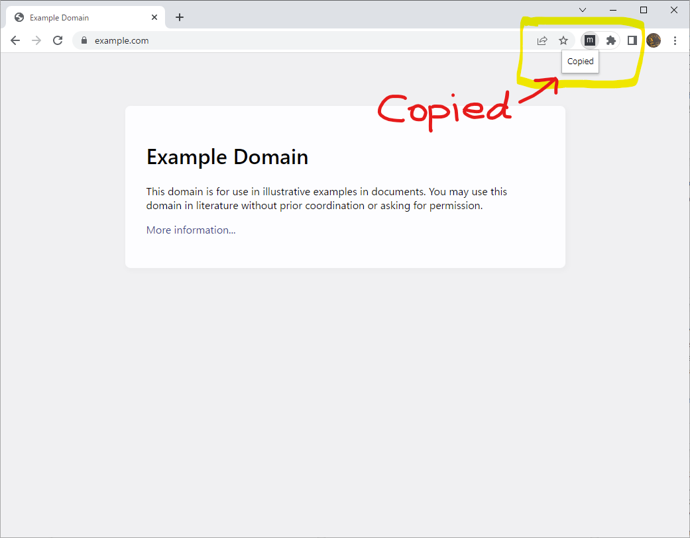
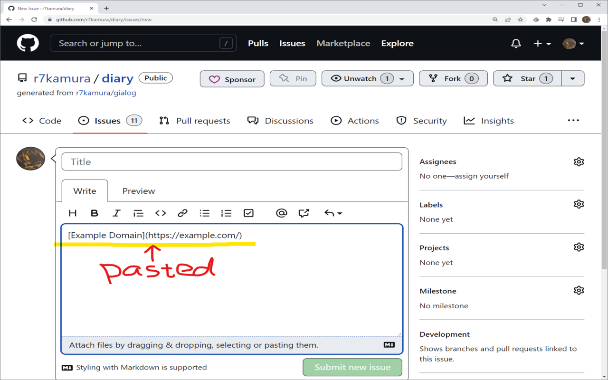

# Copy Markdown Link

Browser extension to copy link in Markdown format.

## Usage

### Copy

Click the extension icon or press the keyboard shortcut to copy link in Markdown format.

### Keyboard shortcut

The default keyboard shortcut is <kbd>Ctrl + M</kbd>.
This can be changed from the browser's extension settings.
